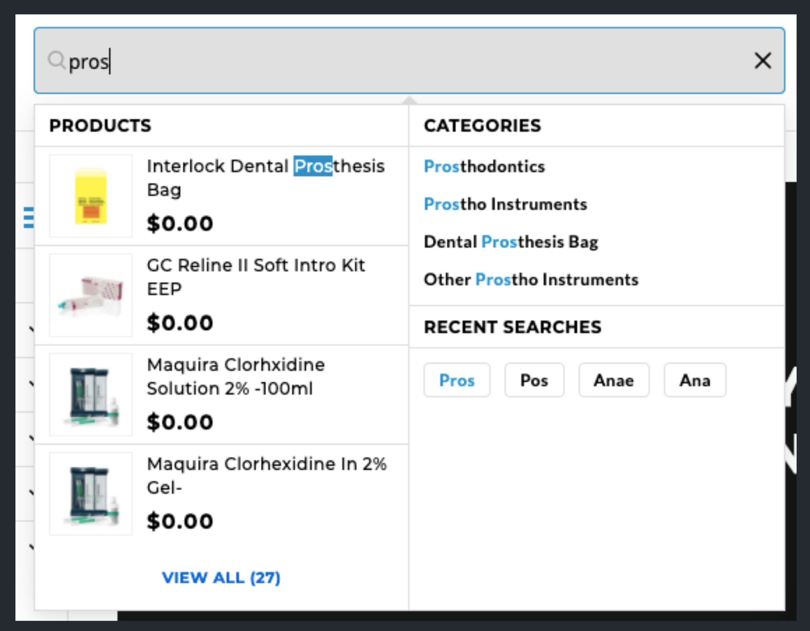

---
# try also 'default' to start simple
theme: seriph
# random image from a curated Unsplash collection by Anthony
# like them? see https://unsplash.com/collections/94734566/slidev
background: https://images.unsplash.com/photo-1490127252417-7c393f993ee4?ixid=MnwxMjA3fDB8MHxwaG90by1wYWdlfHx8fGVufDB8fHx8&ixlib=rb-1.2.1&auto=format&fit=crop&w=3900&q=80
# apply any windi css classes to the current slide
class: 'text-center'
# https://sli.dev/custom/highlighters.html
highlighter: shiki
# some information about the slides, markdown enabled
info: |
  ## Search with RediSearch
---

# RediSearch

---

# The Problem

<v-click>

A feature-rich customizable E-commerce search.



</v-click>

---

# The Solution

There were two options:

1. Whoosh

<v-click> 

- Works well for unstructured data, not suited for structured data (e.g. E-commerce Item data)

- Some hacks are required to get good `autocomplete` to work

- Becomes very slow when `autocomplete` and `fuzzy searching` are added

</v-click>
2. RediSearch

<v-click>

- Build with `structured` data in mind.

- Excellent build-in commands for `autocomplete`, `fuzzy searching` and also `filtering`

- Works with the existing indexed data in `Redis` cache

</v-click>

---

# Installing RediSearch

<v-click>

1. Requires Redis 6+

</v-click>

<v-click>

2. Installation

```bash
$ git clone --recursive https://github.com/RediSearch/RediSearch.git
$ cd RediSearch
$ sudo make setup # No `sudo` for macOS
$ make build
```

</v-click>

<v-click>

3. Loading

```bash
> MODULE LOAD <path-to-binary>
```

</v-click>

---

# Normal Searching with multiple fields

```bash {1|3-5|7-8|10-23}
$ redis-cli

# Inserting data into redis cache
> HSET products:1 name "Apple iPhone 12" keywords "smartphone apple fastest"
> ...

# Creating a secondary index
> FT.CREATE product_idx ON HASH PREFIX 1 products: SCHEMA name TEXT SORTABLE keywords TEXT

# Searching the index
> FT.SEARCH product_idx "smartphone"

1) (integer) 2
2) "products:2"
3) 1) "name"
   2) "Samsung Galaxy s8"
   3) "keywords"
   4) "smartphone samsung' fastest"
4) "products:1"
5) 1) "name"
   2) "Apple iPhone 12"
   3) "keywords"
   4) "smartphone apple fastest"
```

---

# Autocompletion

```bash {1-5|7-10|12-15}
# Adding to autocomplete dictionary named `auto_complete`
# 1 is the weightage

> FT.SUGADD auto_complete "Apple iPhone 12" 1
> FT.SUGADD auto_complete "Apple iPad 10.5" 1

# Getting autocomplete suggesstions
> FT.SUGGET auto_complete "a" MAX 3
1) "Apple iPhone 12"
2) "Apple iPad 10.5"

# With fuzzy
> FT.SUGGET auto_complete "aple" FUZZY  MAX 3
1) "Apple iPhone 12"
2) "Apple iPad 10.5"
```

---
# Awesome Conf Talk on RediSearch

<Youtube id="B_BVmJ90X8Q" class="text-center w-full h-100" />

---

---
layout: center
class: 'text-white'
---​

# > exit